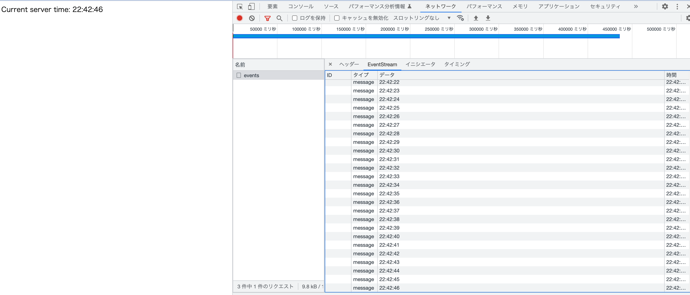

# 概要
Server-Sent Events(SSE)のサンプルコード
SSEはサーバからクライアントへの単方向通信を行う技術

SSEによって、サーバ側が一定時間ごとにイベントデータをクライアントに送信し、
クライアントはメッセージ受信イベントをトリガーに画面の時刻を更新する




# 手順
```
npm install

# サーバ起動
npm run dev

# フロントエンドのjsファイルをコンパイル
npx tsc src/client.ts

# index.htmlをブラウザで開く
open src/index.html
```
